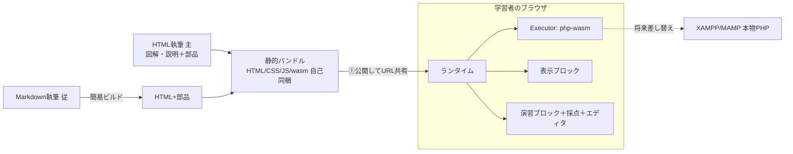

# PHP基礎・埋め込み実行型 学習システム 設計書

- 日付: 2026-06-02
- ステータス: ドラフト（ユーザーレビュー待ち）
- 対象: PHPの基礎を学ぶための、HTML内にPHP実行を埋め込めるCodeSandbox風の学習システム

---

## 1. 目的・背景

PHPの基礎（変数・配列・制御構文・関数・文字列処理など）を学ぶための教材を作る。
教材の中に**その場で実行できるコード**を埋め込み、学習者が結果を見ながら、また自分で書き換えながら学べる体験を提供する。イメージは CodeSandbox の埋め込み。

要件の要点：

- **表示専用ブロック**と**編集・実行できる演習ブロック**を作り分けできる。
- 1行コードは**コンパクト表示（結果は下）**、複数行コードは**左右表示（左=コード／右=出力）**。
- 学習の流れは「①やり方を教える → ②練習問題（スターターコード入り） → ③学習者のコードを実行してチェック → ④期待出力があれば正解/不正解を判定」。**採点ON/OFFはブロック単位**で選べる。
- **リッチな見た目はHTMLで作るのが主**。図解・説明・レイアウトを自由に。Markdownは手軽に書きたい時の従の道。
- 配布は**サーバーを持たない前提**。v1は「リンクを渡せばすぐ実行できる」を本命にする。

## 2. 用語

| 用語 | 意味 |
|---|---|
| ランタイム | ブロックを動かす1枚のJSライブラリ（Webコンポーネント＋実行エンジン＋エディタ＋採点） |
| Executor | 「PHPコード → 出力」を返す部品。差し替え可能なインターフェース |
| php-wasm | PHPをWebAssembly化しブラウザ内で実行する仕組み（seanmorris/php-wasm） |
| 表示ブロック | 見せるだけのコード＋結果。`<php-run>` |
| 演習ブロック | 編集・実行・採点できるコード。`<php-exercise>` |
| 静的バンドル | ビルド/配布される静的ファイル一式（HTML/CSS/JS/wasm） |

## 3. 対象ユーザー

- **著者（あなた）**: 教材を作る人。HTMLを書ける。リッチな見た目を重視。
- **学習者**: 教材を受け取って学ぶ人。技術前提なし。**渡されたリンクをクリックするだけ**で学習を始められること。

## 4. スコープ

### v1でやること（In）
- ランタイム（Webコンポーネント `<php-run>` / `<php-exercise>`）。
- php-wasm による**ブラウザ内PHP実行**（Executorのphp-wasm実装）。
- 表示ブロック（1行=コンパクト／複数行=左右）。
- 演習ブロック（スターターコード・実行・出力・エラー表示・リセット・任意の模範解答）。
- 採点（期待出力との正規化比較で**正解/不正解**、`expected`の有無で採点ON/OFF）。
- 学習者の編集コードを**localStorageに自動保存**（同一端末で続きから）。
- **HTML執筆（主）**の書き方確立。**Markdown執筆（従）→ HTML 変換**の簡易ビルド。
- **配布=リンク（①）**: 静的バンドルを無料ホスティングに公開しURL共有。wasm資産は**自己同梱**（CDN非依存）。
- **サンプルレッスン3本以上**（両ブロック・採点あり/なしのデモ）。

### v1でやらないこと（Out / 将来拡張）
- ②オフライン配布（ZIP＋ダブルクリック起動ツール）。※自己同梱済みなので移行は容易。
- 「単一HTMLをダブルクリックだけで実行」（`file://`制限のため別途検証）。
- ③XAMPP/MAMP（本物PHP）実行 ＝ Executorの差し替え実装。
- 実MySQL・セッション永続・メール送信などサーバー固有機能。
- WYSIWYG（WordPressライク）編集UI。
- 学習者アカウント・端末間同期・進捗のサーバー保存。
- 複数テストケース採点・標準入力(stdin)・自動採点の高度化。

## 5. アーキテクチャ概要



**設計の肝**: 画面・教材・採点UIは1セットだけ作り、「コードを実行して出力を返す」部分（Executor）をインターフェースで分離する。これにより v1（php-wasm）で作り、将来 XAMPP 実装を足すだけで本物PHP実行に対応できる。

## 6. コンポーネント設計

各ユニットは「何をするか／どう使うか／何に依存するか」が明確になるよう小さく分割する。

### 6.1 Executor（実行エンジン抽象）
- **責務**: PHPソースを受け取り実行し、出力を返す。
- **インターフェース**:
  ```ts
  interface Executor {
    // 初回呼び出し時にエンジンを遅延初期化
    run(code: string, opts?: { timeoutMs?: number }): Promise<RunResult>;
  }
  type RunResult = { stdout: string; stderr: string; exitCode: number; durationMs: number };
  ```
- **実装(v1)**: `WasmExecutor`（php-wasm）。エンジンは**1ページ1インスタンスを遅延生成**し全ブロックで共有。
- **実装(将来)**: `HttpExecutor`（XAMPPの`run.php`にPOSTして実行結果を受け取る）。
- **依存**: php-wasm（@php-wasm/web 等）。

### 6.2 ランタイム本体
- **責務**: Webコンポーネントを登録し、設定（Executor選択など）を提供。`<script type="module">`1枚で読み込める。
- **公開API（最小）**: `window.PhpLesson.configure({ executor })` 程度。既定はphp-wasm。

### 6.3 表示ブロック `<php-run>`
- **責務**: コードと実行結果を表示する（編集不可）。
- **入力**: 子要素 `<script type="text/php">…</script>` にPHPコード。
- **挙動**: ブロックが画面内に入った時に実行し結果を表示（IntersectionObserverで遅延。最初に表示が必要になったブロックでwasmを初期化）。
- **レイアウト**: コードの**論理行数が1行ならコンパクト（コード→下に結果）**、2行以上なら**左右（左コード／右出力）**。属性 `layout="compact|split|stacked"` で上書き可。

### 6.4 演習ブロック `<php-exercise>`
- **責務**: 学習者がコードを編集・実行し、必要なら採点する。
- **入力**: 子 `<script type="text/php">…</script>` を**スターターコード**として表示。
- **UI**: エディタ＋出力パネル＋ボタン（▶実行／↺スターターに戻す／👁模範解答[solution指定時のみ]）。
- **採点**: `expected` 属性があれば実行後に出力を比較し**正解/不正解**を表示（=採点ON）。無ければ自由練習（=採点OFF）。
- **永続化**: 編集内容を localStorage に保存し、再訪時に復元。

#### `<php-exercise>` 属性
| 属性 | 必須 | 既定 | 意味 |
|---|---|---|---|
| `expected` | 任意 | なし | 期待出力。指定で採点ON |
| `match` | 任意 | `exact` | 比較方法 `exact`(正規化一致)/`contains`(含む)。`regex`は将来 |
| `solution` | 任意 | なし | 模範解答コード。指定時のみ「模範解答」ボタン表示 |
| `layout` | 任意 | 自動 | `split`/`stacked` |
| `id` | 任意 | 自動 | localStorageキー。未指定はページパス＋出現順で自動採番 |

### 6.5 Checker（採点）
- **責務**: 実行出力と `expected` を比較し合否を返す。
- **正規化規則（exact時）**: ①改行を`\n`へ統一 ②全体の前後空白を`trim` ③各行末の空白除去。その上で文字列一致で判定する（行中・行間の空行はそのまま比較対象とし、予期せぬ一致を避ける）。
- **出力**: `{ pass: boolean, normalizedExpected, normalizedActual }`（不一致時は差分表示に利用）。

### 6.6 Editor
- **責務**: PHPのシンタックスハイライト付きコード編集。
- **実装**: CodeMirror（PHPモード）。軽量化のため遅延読み込み。

### 6.7 Markdownビルド（従）
- **責務**: Markdown＋専用コードフェンスを、同じ部品を使うHTMLへ変換。
- **記法**: ` ```php run ` → `<php-run>`、` ```php exercise expected="15" ` → `<php-exercise expected="15">`。
- **位置づけ**: 主たるHTML執筆の補助。v1は最小限の変換で可。

## 7. 執筆フォーマット仕様

### 7.1 主：HTML
```html
<!-- ランタイムを1枚読む（wasm資産は同梱・自己ホスト） -->
<script type="module" src="/assets/php-lesson.js"></script>

<article class="lesson">
  <h1>変数を学ぼう</h1>
  <figure class="diagram"><!-- 図解は自由にHTML/CSS/SVG --></figure>
  <p>変数は値の入れ物です。</p>

  <!-- 表示ブロック -->
  <php-run>
    <script type="text/php">echo "こんにちは";</script>
  </php-run>

  <!-- 演習ブロック：スターター＋採点ON -->
  <php-exercise expected="15">
    <script type="text/php">
$a = 7; $b = 8;
// ここに答えを書く
    </script>
  </php-exercise>
</article>
```
- PHPコードは `<script type="text/php">` に入れる方式を基本とする（`<` `&` 等のエスケープ不要・記号の多いPHPでも安全）。

### 7.2 従：Markdown
````md
## 変数を学ぼう
変数は値の入れ物です。

```php run
echo "こんにちは";
```

```php exercise expected="15"
$a = 7; $b = 8;
// ここに答えを書く
```
````

## 8. 実行エンジン（php-wasm）詳細

- **ビルド種別**: **非スレッド版**を用いる。理由：スレッド版はCross-Origin Isolation（COOP/COEP）ヘッダが必要だが、無料静的ホスティング（GitHub Pages等）では設定しづらいため。基礎学習の用途では単一スレッドで十分。
- **資産配置**: php-wasmのJS/wasmは**バンドルに自己同梱**しCDN非依存。
- **初期化**: 最初に実行が必要になった時点で1度だけ初期化（遅延）。ページ内ブロックでインスタンス共有。
- **カバレッジ**: 変数/配列/制御構文/関数/文字列・日付/正規表現/JSON/OOP、`$_GET`・`$_POST`の擬似、PDO+SQLite等の基礎は実行可能。**実MySQLやサーバー固有挙動は対象外**。
- **タイムアウト/暴走対策**: 実行に上限時間を設け、超過時はエラー表示（無限ループ対策）。

## 9. 配布

- **v1（本命）= ①リンク**: 静的バンドルを無料ホスティング（GitHub Pages / Netlify / Cloudflare Pages 等）に公開し、URLを共有。受け取る人は**クリックのみ・インストール不要**、Mac/Win/スマホで即実行。実行時にネット接続が必要。
- **将来 = ②オフライン**: 同じバンドル（wasm自己同梱済み）をZIP配布。`file://`直開きの制限回避のため**小さな起動ツール（ローカル静的サーバ）を同梱**しダブルクリック起動。「単一HTMLダブルクリック」は別途検証項目。
- **将来 = ③XAMPP/MAMP**: `HttpExecutor`＋`run.php`で本物PHP実行（MySQL等）。

## 10. 見た目・レイアウト

- 表示ブロック：1行=コンパクト（コードの直下に結果）／複数行=左右2カラム（左コード・右出力テキスト）。
- 演習ブロック：上部に左右（左エディタ・右出力）、下部にボタン列と合否表示。
- **レスポンシブ**: 画面が狭い時は左右レイアウトを上下に折り返す。
- リッチな装飾は著者がHTML/CSSで自由に付与。ランタイムはブロック内のUIに責務を限定（教材全体のデザインを乗っ取らない）。

## 11. 技術選定（実装時に最終確定）

| 項目 | 採用案 | 備考 |
|---|---|---|
| 実行エンジン | php-wasm（seanmorris/php-wasm, 非スレッド） | ブラウザ内PHP |
| ブロック実装 | Web Components（Custom Elements） | 任意のHTMLに差し込める |
| エディタ | CodeMirror（PHPモード） | 遅延読み込み |
| Markdownビルド | 軽量変換（必要に応じ Astro 等の静的生成） | 従の道。v1最小 |
| 言語 | TypeScript | ランタイム実装 |
| 配布 | 静的ホスティング（GitHub Pages 等） | サーバー運用不要 |

## 12. ディレクトリ構成（案）

```
TechEducate/
├─ runtime/                 # ランタイム実装(TS)
│  ├─ executor/             # Executor IF / wasm実装 / (将来)http実装
│  ├─ components/           # php-run, php-exercise
│  ├─ checker/              # 採点
│  ├─ editor/               # CodeMirrorラッパ
│  └─ index.ts              # Custom Elements登録・設定API
├─ assets/                  # ビルド済み php-lesson.js + wasm資産
├─ lessons/                 # 著者が書くHTMLレッスン（主）
├─ lessons-md/              # Markdownレッスン（従）
├─ build/                   # Markdown→HTML変換・バンドル
├─ samples/                 # サンプルレッスン3本以上
└─ docs/superpowers/specs/  # 本設計書
```

## 13. リスクと検証項目

| リスク/不確実性 | 対応 |
|---|---|
| `file://`での単一HTML実行の可否 | v1対象外。将来②で起動ツール同梱、もしくは事前に試作で検証 |
| wasmサイズ（数MB）による初回読み込み | 遅延初期化・実行が必要になるまでロードしない |
| php-wasmの機能カバレッジ | 基礎範囲で検証。非対応（実MySQL等）はドキュメント明記 |
| `<script type="text/php">`内コードの取り回し | エスケープ不要方式で安全性確保。空白整形に注意 |
| 採点の正規化での想定外一致/不一致 | 正規化規則を明文化し、サンプルで検証。`match=contains`を用意 |
| 無限ループ等の暴走 | 実行タイムアウトを設定 |

## 14. 受け入れ条件（v1完成の定義）

1. 著者がHTMLレッスンに `<php-run>` / `<php-exercise>` ＋ランタイムを置き、（ホスティング/ローカルサーバ経由で）ブラウザで開くとブロックが動く。
2. `<php-run>` が1行=コンパクト、複数行=左右で表示される。
3. `<php-exercise>` がスターターコードを表示し、▶実行でphp-wasm実行され、出力とエラーが表示される。
4. `expected` 指定時、実行後に正規化比較で**正解/不正解**が正しく表示される。未指定時は採点なしで自由に実行できる。
5. ↺で初期コードに戻り、`solution` 指定時に模範解答が見られる。
6. 編集内容がlocalStorageに保存され、リロード後も復元される。
7. バンドルを静的ホスティングに公開し、**URLを開くだけ**で学習できる（①）。wasm資産は自己同梱でCDN非依存。
8. サンプルレッスンが3本以上あり、両ブロック・採点あり/なしを実演している。
9. Markdownレッスン1本が変換で動くHTMLレッスンになる（従）。

## 15. 将来拡張

- ②オフラインZIP配布（起動ツール同梱）、単一HTMLダブルクリックの検証。
- ③XAMPP/MAMPでの本物PHP実行（`HttpExecutor`＋`run.php`）、MySQL等の中級教材。
- WYSIWYG（WordPressライク）編集：同じHTML/部品を出力する編集UI。
- 採点高度化（複数テストケース・stdin・正規表現一致）、進捗保存、章立て/ナビゲーション。

## 16. 変更履歴

| 日付 | 変更 |
|---|---|
| 2026-06-02 | 初版ドラフト作成 |
